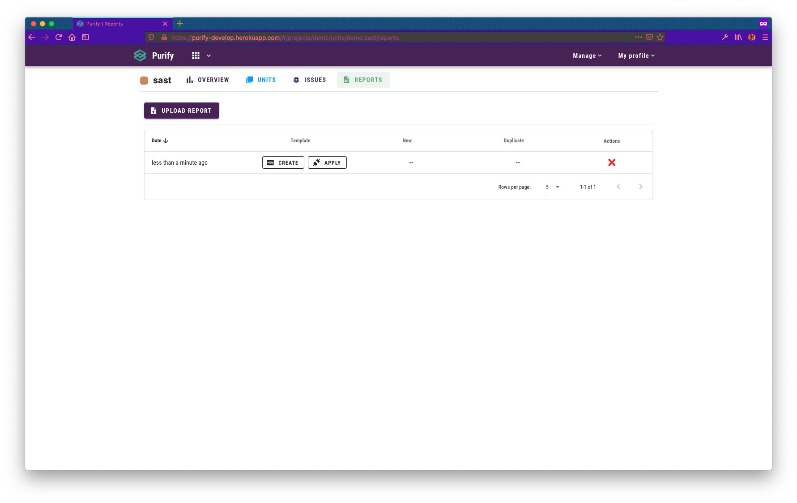
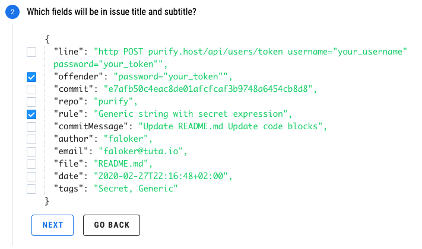
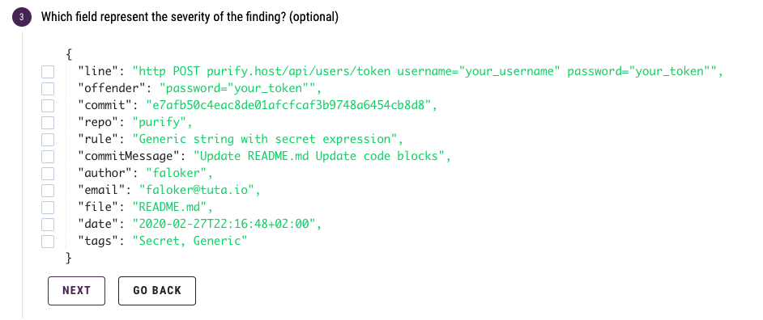

# Templates

## Overview

The purpose of templates is to parse incoming reports to extract findings, remove duplicates and merge findings which have something in common. That means that the way you create a template will define how you will operate with the findings of a particular tool.

## Requirements

You need to upload a report to Purify. See how to do it [here](upload-report.md). 


If you do not have any reports at hand, you can use reports from [here](../report-samples.md).


## Action

In this section we will go through all steps of template creation.

Go to the reports page for which unit you uploaded a report:

Click on the **Create Template** button and you will see the **Template Configurator**:

### Step 1

You will need to select an array with issues. **Why?**

Sometimes ****security tools reports may contain some additional debug or configuration information that is completely pointless to you. Purify will extract all arrays from the document and show you an example of their elements, you will need to **select an array containing the scan results**.  

### **Step 2**

Choose the fields that will be treated as the title and subtitle, just decide which combination of fields will be more suitable for you.


You can select as many fields as you want, without restrictions.


### Step 3

Sometimes findings delivered with severity field, you can select this field on the third step:

### Step 4

Based on the fields you choose previously you need to create patterns to display them. You can use any combination of characters or stay simple:

### Step 5

Now we need to decide what fields will represent issue body:

### Step 6

Here you need to select the field types so that everything is displayed correctly. Optionally, you can change the display names for the fields if the default is not meaningful enough:

### Step 7

Now we come to a serious matter. You need to select the fields that will be used to find the same findings at the template 

### Step 8

The last important step is to select fields that will be merged if the issues look the same \(**Step 7**\). Merging occurs only for issues within the same template.


This step is **optional** because sometimes tools generate only unique findings and there is no need in merging


### Step 9

Let's say you decided to give a try [gitleaks](https://github.com/zricethezav/gitleaks), after using [truffleHog](https://github.com/dxa4481/truffleHog) \(yet another tool for finding secrets\). Obviously, you want to see only what's new gitleaks can find. 

That's why you need to select fields for which values Purify will perform a lookup **on all issues inside the unit**. If all these fields exist in any issue, Purify will treat the new issue as duplicate and will not process it.

### **Step 10**

### Final

As result of these actions we have 16 new issues

Now go to the **Issues** tab and explore them all:

