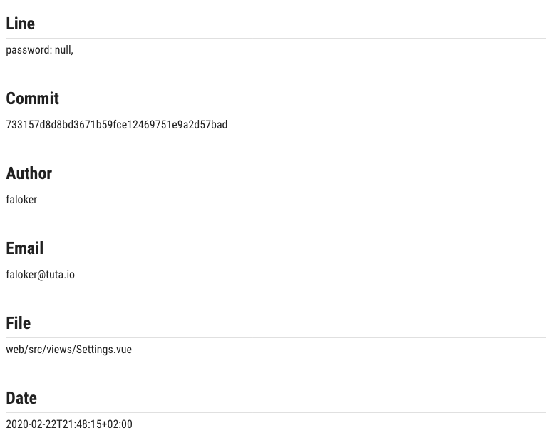
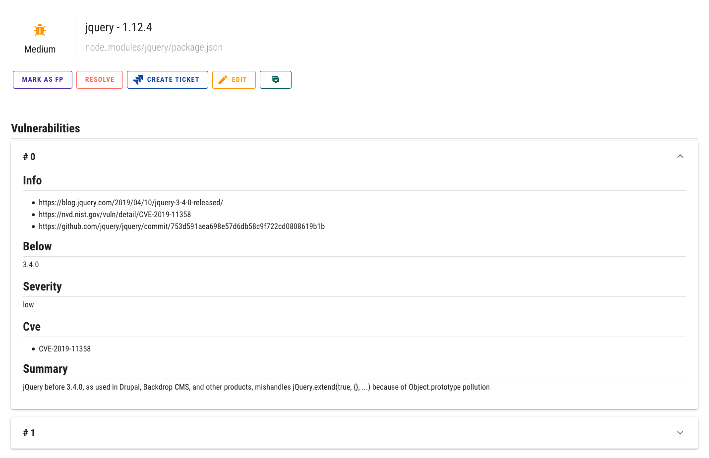

# Issues

## Overview

Issues are extracted from reports based on templates you are specified. Basically, you're interested in the issues fields and Purify can represent them in multiple forms.

## Actions

You can do the following with issues:

* Mark as False Positive
* Mark as Accepted Risk
* Resolve
* Create Jira ticket
* Edit issue fields
* Leave a comment

## Examples

### Simple

Like issues of **Gitleaks**, each field is a piece of text

### Tricky

Like issues of **RetireJS**, when each package contains a list of associated vulnerabilities

