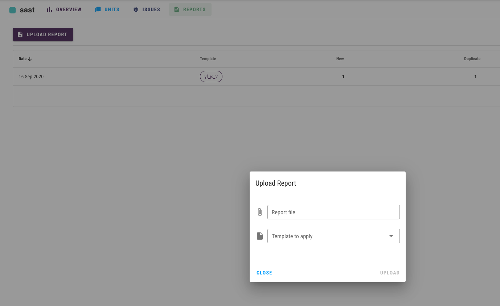

# Reports

## Requirements

To upload a report you need to have:

1. Project and unit within this project

## Uploading

When uploading reports, you have two options: via the user interface on the reports tab of a specific unit, or via the API.

### Files

Now you can upload the report as **JSON** or **XML** file.


**unitName** is a combination of the project name and the unit name. In the example below

```text
osint.google
```

The project name is **osint** and the unit name is **company**.


```bash
http -f POST https://hostname/api/units/bla.bla/reports  \
    "apikey: $PURIFY_TOKEN" \
    file@gitleaks-example.json
```

If you already created a template for such tool, you need to provide it, so report content will be parsed automatically

```bash
http -f POST https://hostname/api/units/bla.bla/reports  \
    "apikey: $PURIFY_TOKEN" \
    template="gitleaks" \
    file@gitleaks-example.json
```

### UI

And, of course, you can upload reports via the user interface, you can find the button for uploading at the **Reports** tab of a particular unit:



### Oneshot

In addition, you can upload your results as separate JSON objects. The most common use case is getting events from the webhook from other tools or systems.


This can be done only via API.


To upload a oneshot:

```bash
http POST :3000/api/units/bla.bla/oneshots \
    "apikey: $PURIFY_TOKEN" \
    < Downloads/gitleaks-one-object.json
```

To apply a template:

```bash
http POST :3000/api/units/bla.bla/oneshots/gitleaks \
    "apikey: $PURIFY_TOKEN" \
    < Downloads/gitleaks-one-object.json
```

## API Reference

[https://purify-develop.herokuapp.com/swagger/\#/reports](https://purify-develop.herokuapp.com/swagger/#/reports)

