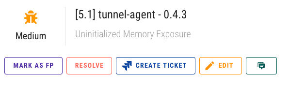
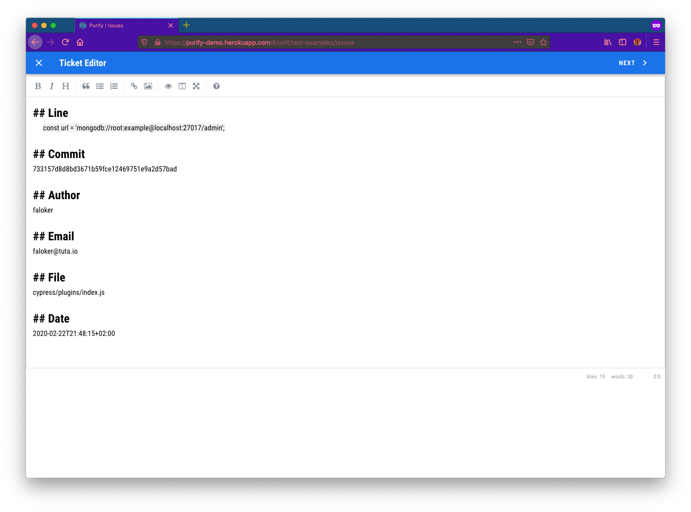
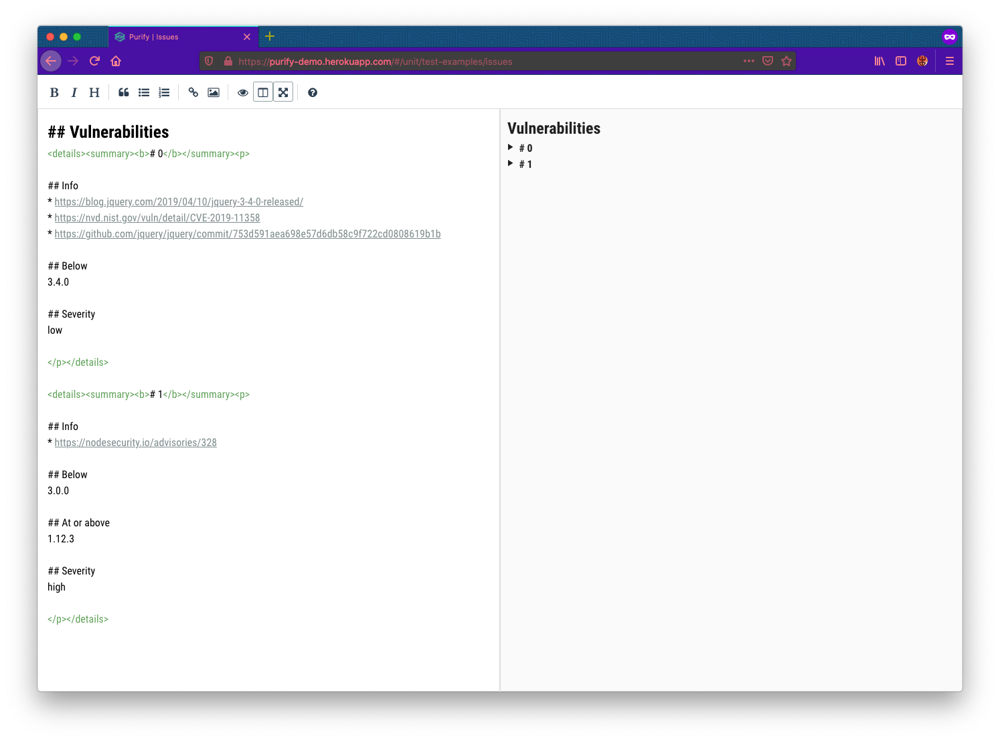
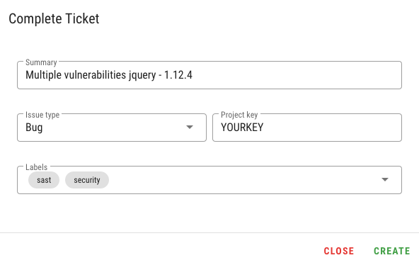

# Jira

## Overview

Purify allows you to create Jira tickets. 

In addition, Purify will track changes in created tickets, and if tickets will be resolved, Purify will also close them. 

## Configuration

First, you need to get Atlassian API token. Go [here](https://id.atlassian.com/manage/api-tokens) to create them.

Second, do the following:

```bash
http POST https://purifyhost/api/settings/jira \
    "apikey: your-api-token" \
    username="myemail@domain.com" \
    host="mycompany.atlassian.net" \
    api_key="xxxxxxx"
```

If there are no errors, then everything is fine.

## Action

In the issue view you can see pretty straightforward button:



If you click on it, Purify will convert the issue into Markdown and give you the ability to edit its content:




Jira does not support markdown **&lt;details&gt;** feature, so it will not the same as on the preview below. Consider refactoring it.




When you're done with refactoring, click on **Next** and complete ticket


Currently, when Purify creates a Jira ticket, it sets **Unassigned** as the assignee.





Purify will convert markdown, into Jira compatible markdown, so your issue will look exactly like the preview.


## Extras

> In addition, Purify will track changes in created tickets, and if tickets will be resolved, Purify will also close them.

When it happens, Purify will add the following comment to the issue:


