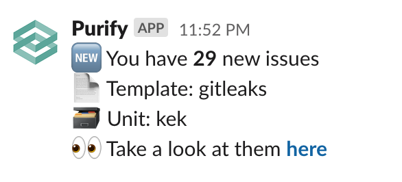

# \[DISABLED\] Slack

## Overview

There is one thing that Purify can do with Slack - send messages via webhook. That's it.

Currently, this awesome integration is used to notify you if:

* You got a report with new findings never seen before
* Jira ticket was resolved with status **Done** and Purify automatically resolved it

## Configuration

First, you will need a webhook from Slack, see [here](https://api.slack.com/messaging/webhooks) what you need to do.

Second, do the following:

```bash
http POST https://purifyhost/api/settings/slack \
    "apikey: your-api-key" \
    webhook="https://hooks.slack.com/services/xxxxxxx/xxxxxx/xxxxx"
```

 As a result you should see this:


## Examples

> You got a report with new findings never seen before



> Jira ticket was resolved with status **Done** and Purify automatically resolved it


